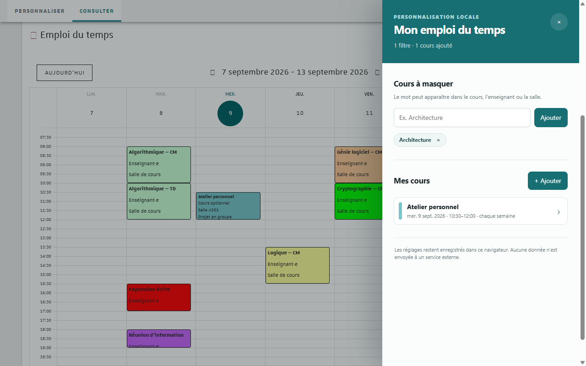

# Unistra Schedule

Une extension Chrome indépendante pour adapter le calendrier en ligne de l’Université de Strasbourg à son propre emploi du temps.



## Fonctionnalités

- masquer les cours dont le titre, l’enseignant ou la salle contient un mot-clé ;
- ajouter des cours personnels avec date, horaires, enseignant, salle, note et couleur ;
- répéter un cours chaque semaine jusqu’à une date choisie ;
- modifier ou supprimer un cours en cliquant dessus dans le calendrier ;
- conserver les réglages localement dans le navigateur.

L’extension fonctionne uniquement sur `monemploidutemps.unistra.fr`. Elle ne contient ni suivi d’audience, ni publicité, ni appel vers un service externe.

> Ce projet est indépendant et n’est ni édité, ni approuvé, ni maintenu par l’Université de Strasbourg.

## Installation locale

1. Télécharger ou cloner ce dépôt.
2. Ouvrir `chrome://extensions` dans Chrome ou `edge://extensions` dans Edge.
3. Activer le **Mode développeur**.
4. Cliquer sur **Charger l’extension non empaquetée**.
5. Sélectionner le dossier `extension` du dépôt.
6. Ouvrir ou recharger <https://monemploidutemps.unistra.fr/consult/calendar>.

Le bouton **Mon EDT** apparaît en bas à droite du calendrier. L’icône dans la barre d’outils ouvre le même panneau.

## Structure du dépôt

```text
extension/          Code réellement chargé par Chrome
  icons/            Icônes utilisées par le navigateur et le Web Store
store-assets/       Captures et textes destinés à la fiche Web Store
scripts/            Validation et création du ZIP publiable
.github/workflows/  Contrôle automatique sur GitHub
```

Le code ne nécessite ni compilation ni dépendance JavaScript.

## Vérifier et empaqueter

Avec Node.js installé :

```powershell
node --check extension/content.js
node --check extension/background.js
node scripts/validate-manifest.mjs
```

Sous Windows, le script suivant lance ces contrôles et crée le ZIP attendu par le Chrome Web Store :

```powershell
powershell -ExecutionPolicy Bypass -File scripts/package.ps1
```

L’archive est créée dans `dist/`. Son `manifest.json` se trouve directement à la racine du ZIP.

## Contribuer

Les corrections et propositions sont bienvenues. Consultez [CONTRIBUTING.md](CONTRIBUTING.md) avant d’ouvrir une pull request.

Pour préparer une publication, utilisez le [guide Chrome Web Store](docs/CHROME_WEB_STORE.md). Les pratiques relatives aux données sont détaillées dans la [politique de confidentialité](PRIVACY.md).

## Licence

Ce projet est distribué sous licence [MIT](LICENSE).
